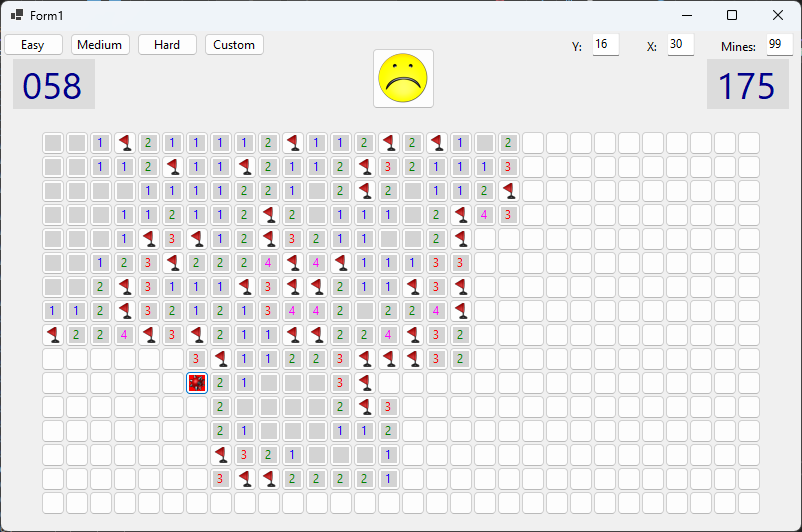

# Minesweeper WinForms



A Windows desktop Minesweeper game built with C# and Windows Forms, targeting .NET 9.

## Features

- Easy: 9 x 9 board with 10 mines
- Medium: 16 x 16 board with 40 mines
- Hard: 30 columns x 16 rows with 99 mines
- Custom board dimensions and mine count
- Left-click to reveal a tile; right-click to place or remove a flag
- Elapsed-time and remaining-mines displays
- Smiley button to restart the game

For a custom board, enter the row count in **Y**, the column count in **X**, and the mine count in **Mines**, then click **Custom**. The board is regenerated when a difficulty is selected or the game is restarted.

## Requirements

- Windows
- .NET 9 SDK, or Visual Studio with .NET desktop development support

## Build and run

Open `WinFormsApp9/WinFormsApp9.csproj` in Visual Studio and run the project, or build it from the repository root:

```powershell
dotnet build .\WinFormsApp9\WinFormsApp9.csproj
```

The game loads its images from `WinFormsApp9/assets`. The current code uses relative paths to these files, so launch the app with a working directory for which those paths resolve to that folder.

## Assets

The Minesweeper icons are provided in `WinFormsApp9/assets`. The included `assets/readme.txt` identifies their source and states that they are licensed under Creative Commons Attribution; see that file for the source link and license details.
